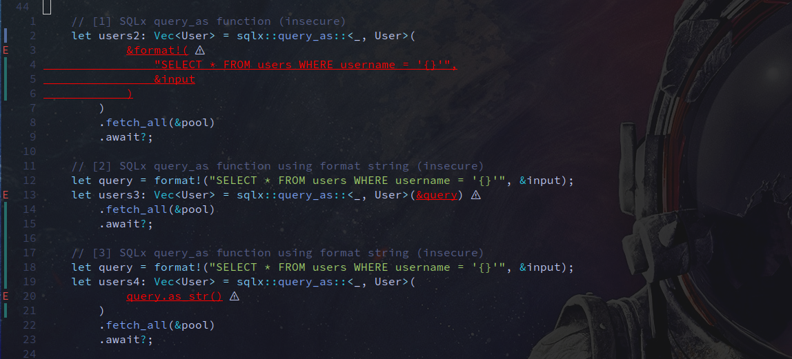

# securitree.nvim

The SecuriTree Nvim Plugin allows a security researcher or developer to highlight sections of code in Neovim which might have security or quality issues with the code.

The project uses [TreeSitter](https://tree-sitter.github.io/) (TS) and [Pattern Matching Queries for TS](https://tree-sitter.github.io/tree-sitter/using-parsers#pattern-matching-with-queries) to search and match on particular points of interest in any code.
Any language with a TS Grammar can be supported and must be install/present for the plugin to search in the code.

Queries are mainly to find points of interest in code and might lead to false positives.

## Demo

**YouTube video by @GeekMasher:**

[](https://www.youtube.com/watch?v=PLHMmYLLhKo)

## Example



## Setup

#### Lazy 

```lua
{
    "GeekMasher/securitree.nvim",
    dependencies = {
        "nvim-treesitter/nvim-treesitter",
        "MunifTanjim/nui.nvim",
        -- optional
        "nvim-treesitter/playground"
    },
    config = function()
        require("securitree").setup {}
    end
}
```

## Queries 

The [queries for any language can be found in the `queries` folder](./queries) in this repository.

## License

This project is licensed under the terms of the MIT open source license. Please refer to [MIT](./LICENSE) for the full terms.

## Support

Please create issues for any feature requests, bugs, or documentation problems.

## Acknowledgement

- @GeekMasher - Author and Maintainer

